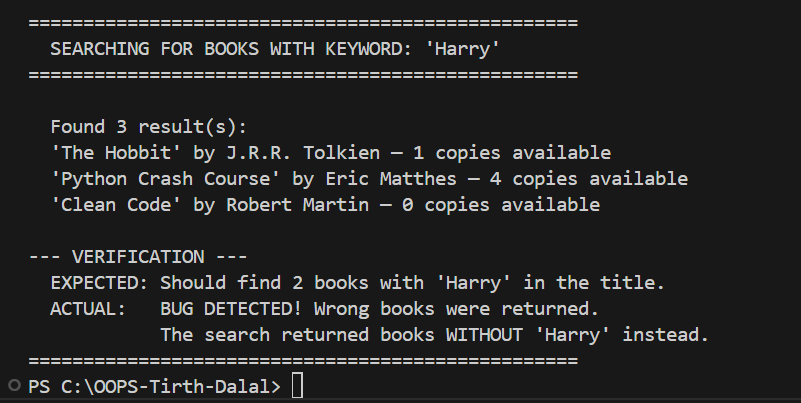
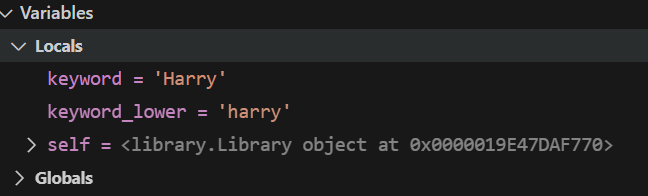
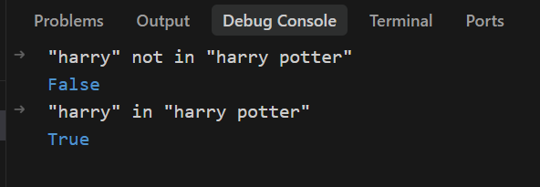

# Debugging Report — Library Management System

**Project:** Library Management System  
**File with Bug:** `library.py`  
**Method with Bug:** `Library.search_books()`  

---

## 1. Bug Description

The `search_books()` method in `library.py` is supposed to find all books whose title contains a given keyword. However, the filtering condition uses `not in` instead of `in`, which causes it to return the **opposite** results — books that do NOT match the keyword.

**Buggy Code (line 38 of library.py):**
```python
results = [book for book in self.books if keyword_lower not in book.get_title().lower()]
```

---

## 2. Expected Result

When searching for the keyword **"Harry"**, the method should return:
1. "Harry Potter" by J.K. Rowling
2. "Harry Potter and the Chamber" by J.K. Rowling

**Expected output:**
```
Found 2 result(s):
  'Harry Potter' by J.K. Rowling
  'Harry Potter and the Chamber' by J.K. Rowling
```

---

## 3. Actual Result

The method returns 3 books that do NOT have "Harry" in the title:

```
Found 3 result(s):
  'The Hobbit' by J.R.R. Tolkien
  'Python Crash Course' by Eric Matthes
  'Clean Code' by Robert Martin
```

---

## 4. Root Cause

The comparison operator in the list comprehension is **inverted**.

- `keyword_lower not in book.get_title().lower()` → returns True when the keyword is **NOT** found
- `keyword_lower in book.get_title().lower()` → returns True when the keyword **IS** found

This single word `not` flips the entire search logic.

---

## 5. Debugging Steps

### Step 1: Observe the Wrong Output
Run `python main.py` and notice the search returns wrong books (books without "Harry" instead of books with "Harry").

### Step 2: Set a Breakpoint
Open `library.py` in your IDE (VSCode or PyCharm). Click on the left side of **line 38** to set a breakpoint (the red dot).

### Step 3: Start the Debugger
In VSCode: Press `F5` → Select "Python File" → The program runs and pauses at line 38.

### Step 4: Inspect Variables
In the debugger's Variables panel, check:
- `keyword_lower` = `"harry"`
- `self.books` = list of 5 book objects

### Step 5: Test the Condition Manually
In the Debug Console, type:
```python
"harry" not in "harry potter"
```
Result: `False` — This means "Harry Potter" is **excluded** from results!

Then type:
```python
"harry" in "harry potter"
```
Result: `True` — This is the correct condition.

### Step 6: Identify the Fix
The word `not` needs to be removed from the condition.

---

## 6. Screenshots

> **Instructions:** Take these screenshots from your IDE and paste them here before submitting.

**Screenshot 1:** Terminal output showing the bug (wrong search results)

**Screenshot 2:** Debugger paused at line 38 of `library.py` with variables visible

**Screenshot 3:** Debug Console showing `"harry" not in "harry potter"` returning `False`

---

## 7. Final Fix

**Before (Buggy):**
```python
results = [book for book in self.books if keyword_lower not in book.get_title().lower()]
```

**After (Fixed):**
```python
results = [book for book in self.books if keyword_lower in book.get_title().lower()]
```

**Fixed output:**
```
Found 2 result(s):
  'Harry Potter' by J.K. Rowling
  'Harry Potter and the Chamber' by J.K. Rowling

EXPECTED: Should find 2 books with 'Harry' in the title.
ACTUAL:   Search works correctly! Bug has been fixed.
```
